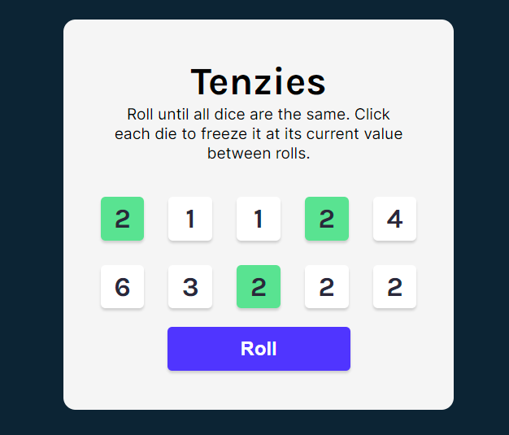

# TENZIES - DICE GAME

Roll all ten of your dice to the same number and win!

## Table of contents

- [Overview](#overview)
  - [The challenge](#the-challenge)
  - [Screenshot](#screenshot)
  - [Links](#links)
- [My process](#my-process)
  - [Built with](#built-with)
  - [Continued development](#continued-development)
  - [Useful resources](#useful-resources)
- [Author](#author)
- [Acknowledgments](#acknowledgments)

## Overview

### The challenge

Objective: Roll all ten of your dice to the same number to win the game!

Users should be able to:

- Click a 'dice' to hold it
- Held dice should be green
- Click 'roll' to roll any dice that aren't held
- Once all held dice are matching, confetti should rain down the page
- Player can click 'new game' to start a new game

### Screenshot

### Links

- Live Site URL: [Add live site URL here](https://your-live-site-url.com)

## My process

### Built with

- [React](https://reactjs.org/) - JS library
- Semantic HTML5 markup
- CSS custom properties
- Flexbox
- CSS Grid+3
- [Confetti Effect](https://github.com/alampros/react-confetti?tab=readme-ov-file#readme) - This is the Confetti effect I used that triggers when the player wins the game

### Continued development

I would like to add other functions to this application in the future:
- Change numbers into dots
- Track number of rolls it takes to win
- Track time it takes to win
- Save 'Best Time' to localStorage

## Author

- Website - [Karen Du](https://karendu.netlify.app)
- GitHub - [@piecanoe](https://github.com/piecanoe)
- Twitter - [@karendufus](https://www.twitter.com/karendufus)

## Acknowledgments

I learned how to build this with the help of Bob Ziroll and Scrimba.
