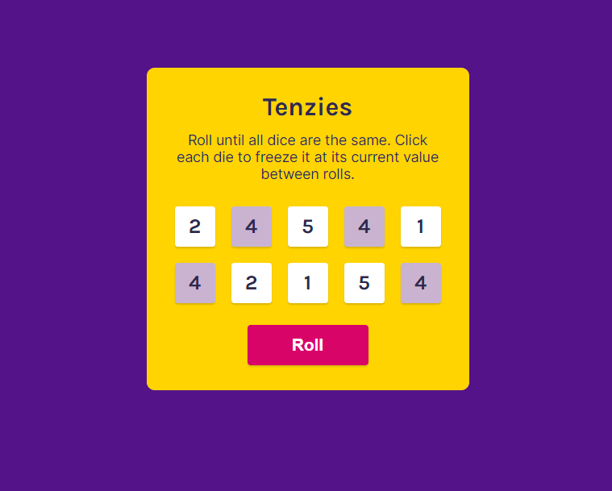

# TENZIES - DICE GAME

Roll all ten of your dice to the same number and win!

## Table of contents

- [Overview](#overview)
  - [The challenge](#the-challenge)
  - [Screenshot](#screenshot)
  - [Links](#links)
- [My process](#my-process)
  - [Built with](#built-with)
  - [Continued development](#continued-development)
  - [Useful resources](#useful-resources)
- [Author](#author)
- [Acknowledgments](#acknowledgments)

## Overview

### Objective

Create Tenzies game that allows players to click each 'die' to freeze the number on the die. Then clicking "Roll" button will generate new numbers on the die that were not previously held. After all held dice are the same number value, the player wins and confetti will rain down the page.

Users should be able to:

- Click a 'dice' to hold it
- Held dice should be green
- Click 'roll' to roll any dice that aren't held
- Once all held dice are matching, confetti should rain down the page
- Player can click 'new game' to start a new game

### Screenshot

### Links

- Live Site URL: [Tenzies](https://tenzies-online.netlify.app)

## My process

### Built with

- [React](https://reactjs.org/) - JS library
- HTML5
- CSS3
- Flexbox
- [Confetti Effect](https://github.com/alampros/react-confetti?tab=readme-ov-file#readme) - This is the Confetti effect I used that triggers when the player wins the game

### Continued development

I would like to add other functions to this application in the future:
- Change numbers into dots
- Track number of rolls it takes to win
- Track time it takes to win
- Save 'Best Time' to localStorage

## Author

- Website - [Karen Du](https://karendu.netlify.app)
- GitHub - [@piecanoe](https://github.com/piecanoe)
- Twitter - [@karendufus](https://www.twitter.com/karendufus)

## Acknowledgments

I learned how to build this with the help of Bob Ziroll and Scrimba.
- [Scrimba](https://scrimba.com/learn/learnreact)
